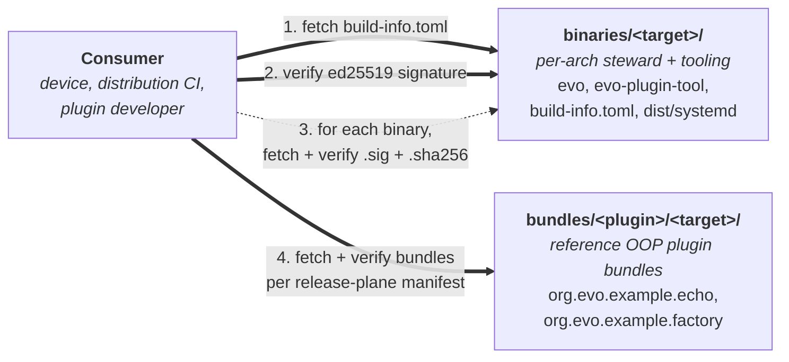

# evo-core-artefacts

> The release plane for [evo-core](https://github.com/foonerd/evo-core). Signed steward binaries and reference plugin bundles, fetched and verified by every device that runs the framework.

Source in. Signed bytes out. Devices and distributions pick the architecture.

This repository is the device-facing surface of the evo-core framework. Release timing is decoupled from development: editing source or documentation in [foonerd/evo-core](https://github.com/foonerd/evo-core) does not touch these assets. What lands here is exactly what an aarch64 / x86_64 / armv7 device fetches and verifies when it installs or upgrades the steward.

## What lives here

Two top-level directories:

- **`binaries/<target>/`** — one directory per cross-built architecture (currently `aarch64-unknown-linux-gnu`, `x86_64-unknown-linux-gnu`, `armv7-unknown-linux-gnueabihf`). Each carries the `evo` steward binary, the `evo-plugin-tool` operator CLI, a per-architecture `build-info.toml` manifest, ed25519 signatures, sha256 digests, and a `dist/systemd/` reference unit example.
- **`bundles/<plugin>/<target>/`** — production-shaped out-of-process plugin bundles (`<name>-<version>-<target>.tar.gz`) for the reference plugin set evo-core ships. Acceptance tests on hardware admit these directly; distributions consuming evo-core can fetch them as worked examples or use them as smoke-test fixtures.

Bundle shape and manifest schema are defined in [evo-core's `docs/engineering/RELEASE_PLANE.md`](https://github.com/foonerd/evo-core/blob/main/docs/engineering/RELEASE_PLANE.md). The contract is OS-agnostic: a generic file-list-with-signatures format that a distribution's release plane reuses for its own pieces.

## Architectures shipped

| Target triple                   | Status                                                                         |
| ------------------------------- | ------------------------------------------------------------------------------ |
| `aarch64-unknown-linux-gnu`     | Shipped from rc.1 onward; validated end-to-end on the Pi 5 prototype           |
| `x86_64-unknown-linux-gnu`      | Shipped from rc.1 onward; cross-build only, no hardware acceptance test today  |
| `armv7-unknown-linux-gnueabihf` | Shipped from rc.1 onward; cross-build only, no hardware acceptance test today  |

Acceptance test posture: cross-build provenance proves the binary was produced cleanly; it does NOT prove the binary boots and admits plugins on hardware of the target arch. A target gets a hardware acceptance entry only after the steward boots, plugins admit, and durability survives restart on real hardware of that architecture.

## Verifying artefacts

Every artefact is signed with the evo-core release signing key. The public half is published in the framework source tree at `crates/evo-trust/keys/evo-core-release-signing-public.pem` and is one of the trust roots a device installs at first bootstrap.

For each binary `<name>` the directory contains:

- `<name>` — the executable, mode `0755`.
- `<name>.sig` — raw ed25519 signature over the executable's bytes (generated with `openssl pkeyutl -sign -rawin`; verify with the symmetric `-verify`).
- `<name>.sha256` — hex digest of `<name>` (diagnostic, plus a fast-fail check before signature verification on small embedded targets where `openssl` is expensive).

The per-architecture manifest:

- `build-info.toml` — bundle kind, source tag, target triple, binary list, build timestamp, publisher namespace, and (when present) `[[auxiliary]]` entries with `path` + `sha256` for every shipped non-binary file (the systemd unit example, its README). The manifest signature transitively covers the auxiliary digests.
- `build-info.sig` — raw ed25519 signature over the manifest bytes.

A consuming script verifies in this order: (1) read `build-info.toml`, (2) verify `build-info.sig` against the framework public key, (3) for every entry in `binaries`, verify the corresponding `.sig` and re-hash to confirm the `.sha256`, (4) for every entry in `[[auxiliary]]`, re-hash and compare to the manifest's recorded digest.

The full schema is documented in [`RELEASE_PLANE.md` §2.1](https://github.com/foonerd/evo-core/blob/main/docs/engineering/RELEASE_PLANE.md).

## Consuming artefacts

Three consumer shapes exist today:

- **Device installer / runbook**: fetches the per-arch directory matching the device's `uname -m`, verifies signatures and digests, installs `evo` and `evo-plugin-tool` to `/opt/evo/bin/`, copies the systemd unit example into `/etc/systemd/system/evo.service` after substituting the distribution-owned `User=` / `Group=` choice, and starts the service. The acceptance-test sequence in [evo-core's `dist/systemd/README.md`](https://github.com/foonerd/evo-core/blob/main/dist/systemd/README.md) is the worked example.
- **Distribution CI**: fetches the same per-arch directory at a tagged version and includes the binaries in its own image build, instead of cross-building evo-core from source per release.
- **Plugin developer**: fetches a reference plugin bundle from `bundles/<plugin>/<target>/` and admits it via `evo-plugin-tool install` against a steward running locally.

The release-plane contract is OS-agnostic by design — evo-core itself never ships Debian control files, Yocto layers, or any other OS-shaped packaging. That layer is owned by individual distributions ([evo-device-volumio](https://github.com/foonerd/evo-device-volumio), and so on); each distribution maintains its own artefacts repository for its OS-specific pieces.

## Publishing artefacts

The publish pipeline lives at [evo-core/.github/workflows/publish.yml](https://github.com/foonerd/evo-core/blob/main/.github/workflows/publish.yml). It triggers on tag push (`v*.*.*`) and on `workflow_dispatch`, runs a per-architecture matrix (`aarch64`, `x86_64`, `armv7`) that:

1. Cross-builds `evo`, `evo-plugin-tool`, and the OOP plugin binaries (`echo-wire`, `factory-wire`) using [`cross`](https://github.com/cross-rs/cross).
2. Stages each binary with `chmod 0755`, signs with the release private key (held as a GitHub Actions secret), records the sha256 alongside, and writes the per-arch `build-info.toml`.
3. Mirrors the framework's reference systemd unit (`dist/systemd/evo.service.example`) plus its README into `dist/systemd/` of the per-arch staging directory; their digests appear in the manifest's `[[auxiliary]]` table.
4. Packs each reference plugin bundle (`<name>-<version>-<target>.tar.gz`) using a host-built `evo-plugin-tool` (so signing runs on a binary the runner can execute, regardless of the matrix target).
5. Uploads each per-arch staging directory as a GitHub Actions artefact.

A final `publish` job collects every matrix output, restores the directory layout (`binaries/<target>/...`, `bundles/<plugin>/<target>/...`), wipes any prior staging from the artefacts repo, and force-pushes a single deterministic commit per release. Channel pointers are not yet wired here; the framework's release plane today is "tag = release", with each tag producing one artefacts-repo commit. Devices that want channel semantics consume from a distribution's artefacts repository (which carries its own `dev` / `test` / `prod` pointers).

## Signing and trust

- **Framework release signing key** — `evo-core-release-signing-public.pem` in the source tree. Signs the steward binary, `evo-plugin-tool`, and the `build-info.toml` manifest. Its private half is held as a GitHub Actions secret on the framework repository and rotated per the framework's key-rotation discipline (documented in [`evo-trust/`](https://github.com/foonerd/evo-core/tree/main/crates/evo-trust)).
- **Plugin signing keys** — separate identity per plugin family. Reference plugins shipped under `bundles/` are signed with the framework key; production plugins shipped by distributions or commons authors use their own keys. Verification at admission consults the device's trust root layout per [`PLUGIN_PACKAGING.md` §5](https://github.com/foonerd/evo-core/blob/main/docs/engineering/PLUGIN_PACKAGING.md).

A device's verification chain treats the framework public key as the root of trust for the steward binary itself; plugin bundles are verified against whichever key authority the trust layout admits for that plugin's namespace.

## Status

Live. Tagged releases populate the repository on every framework `v*.*.*` tag. Channel pointers and a multi-channel manifest are out of the current release-plane revision; today's contract is "one tag, one commit here, one set of bytes per architecture."

## Related

- [foonerd/evo-core](https://github.com/foonerd/evo-core) — the framework source repository this release plane serves.
- [foonerd/evo-device-audio-artefacts](https://github.com/foonerd/evo-device-audio-artefacts) — the reference generic-device release plane; consumes binaries from this repository and ships brand-neutral audio plugins.
- [foonerd/evo-device-volumio-artefacts](https://github.com/foonerd/evo-device-volumio-artefacts) — a vendor-distribution release plane (Volumio); consumes binaries from this repository for the steward and its own pieces for distribution-specific plugins.

## License

Apache 2.0. See [LICENSE](LICENSE).
